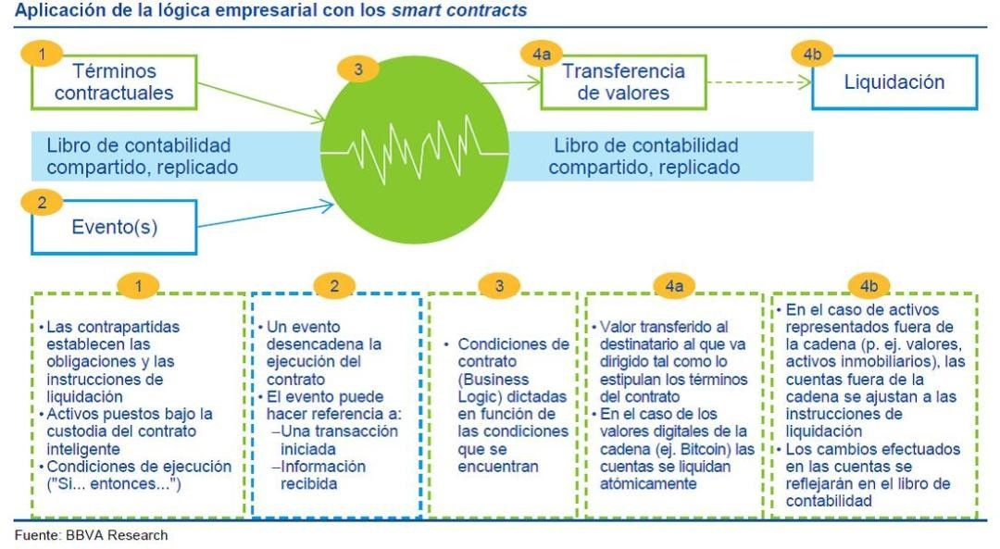
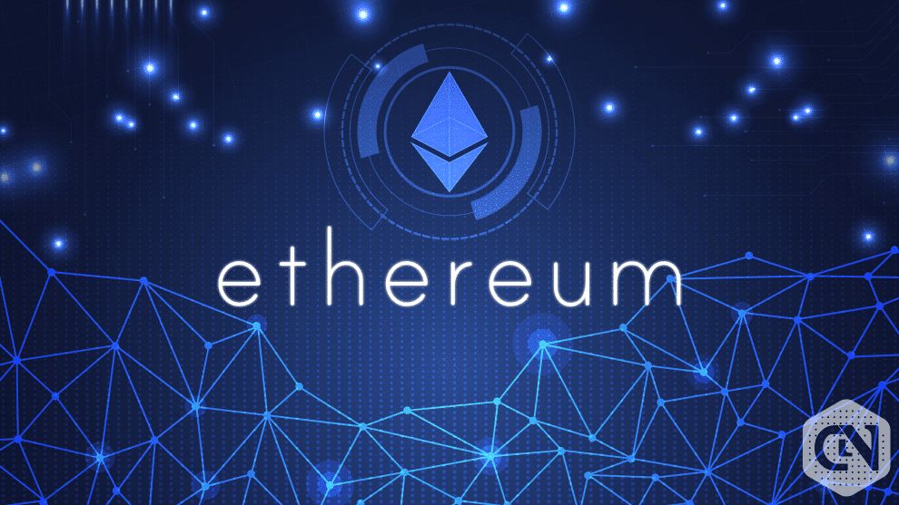
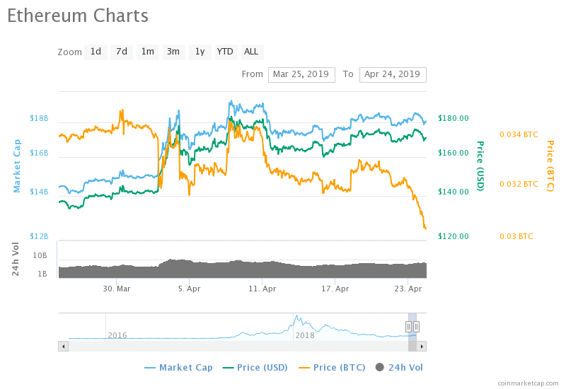
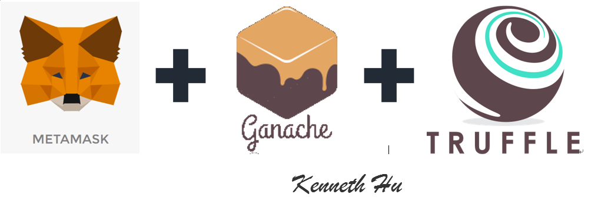

# Blockchain

## Autores

  Pablo García Llorente
  
  Eugenio Alcántara García
  

## Índice

  ####   1. ¿Qué es blockchain?
  
  ####   2. Nuestro proyecto
  
  ####   3. ¿Porqué blockchain?
  
  ####   4. ¿Qué son los contratos inteligentes?
  
  ####   5. Hyperledger y Ethereum
  
  ####    6. Instalación de las herramientas de desarrollo
  
  ####   7. Nuestra primera aplicación
  
  ####   8. Desarrollo de la aplicación
  
  ####   9. Bibliografía
    
##   1. ¿Qué es blockchain?

  
##   2. Nuestro proyecto

 
##   3. ¿Porqué blockchain?
  
##   4. ¿Qué son los contratos inteligentes?

  
##   5. Hyperledger y Ethereum

  
##   6. Instalación de las herramientas de desarrollo

  
##   7. Nuestra primera aplicación

  
  
 
##   8. Desarrollo de la aplicación

##   9. Bibliografía

https://criptomonedasybitcoin.com/contratos-inteligentes/

https://criptomonedasybitcoin.com/la-blockchain-a-fondo/

https://devcode.la/blog/que-es-npm/

https://metamask.io/

https://www.youtube.com/watch?v=ZIGUC9JAAw8

https://truffleframework.com/docs/truffle/overview

https://truffleframework.com/docs/ganache/overview

https://www.ethereum.org/

https://www.hyperledger.org/

https://solidity.readthedocs.io/en/v0.5.8/

www.dappuniversity.com/articles/the-ultimate-ethereum-dapp-tutorial

https://www.youtube.com/watch?v=3681ZYbDSSk

https://medium.com/coinmonks/developing-ethereum-dapps-with-truffle-ganache-and-metamask-31bc5023ce91

