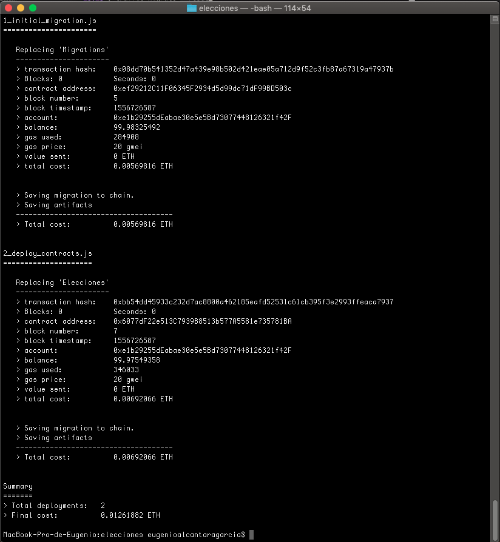
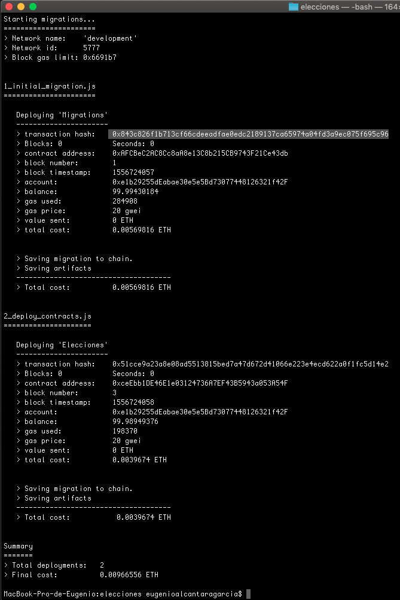
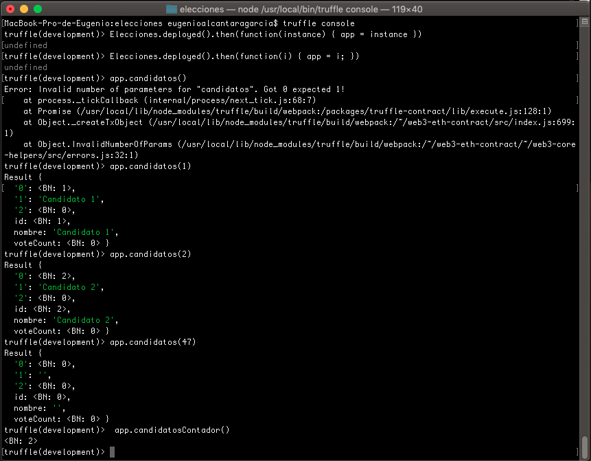
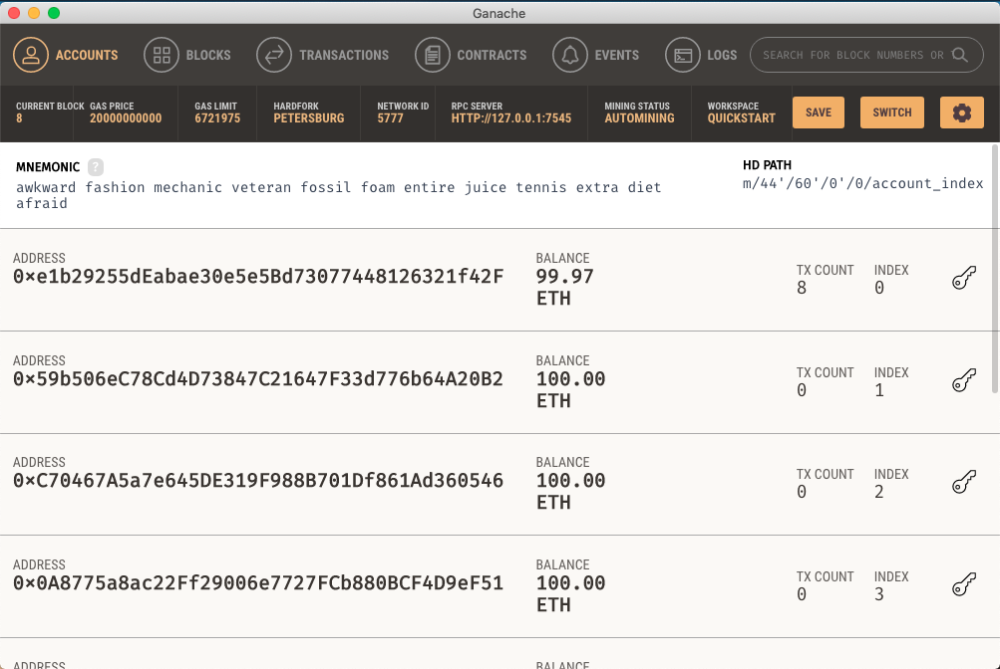
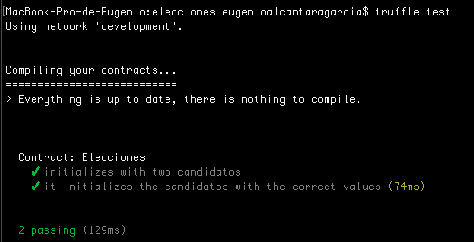
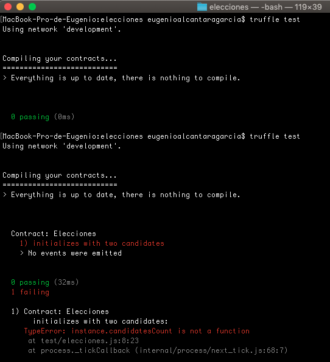
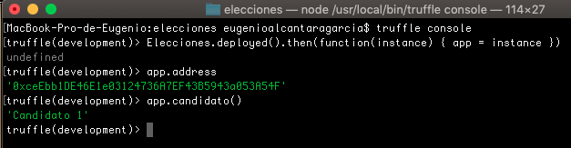
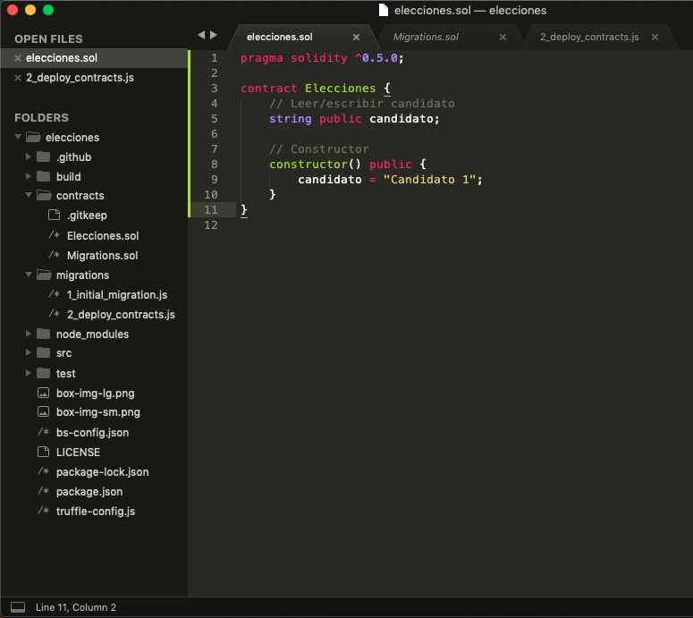
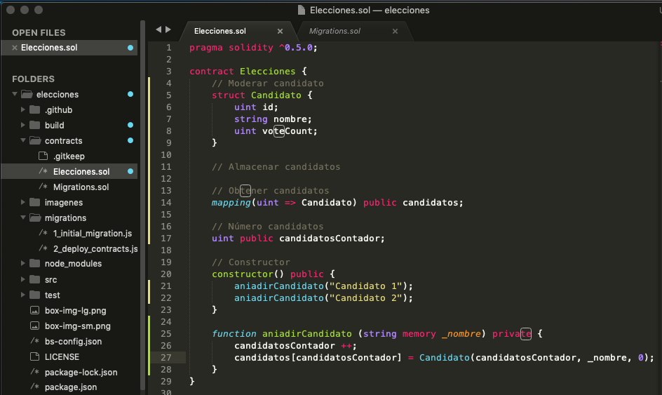

# Blockchain

## Autores

  Pablo García Llorente
  
  Eugenio Alcántara García
  

## Índice

  ###   1 ¿Qué es blockchain?
  
  ###   2 Nuestro proyecto
  
  ###   3 ¿Porqué blockchain?
  
  ###   4 ¿Qué son los contratos inteligentes?
  
  ###   5 Hyperledger y Ethereum
  
  ###   6 Instalación de las herramientas de desarrollo
  
  ###   7 Nuestra primera aplicación
  
  ###   8 Desarrollo de la aplicación
  
  ###   9 Bibliografía
  

  
##   1 ¿Qué es blockchain?
  
##   2 Nuestro proyecto
 
##   3 ¿Porqué blockchain?
  
##   4 ¿Qué son los contratos inteligentes?
  
##   5 Hyperledger y Ethereum
  
##   6 Instalación de las herramientas de desarrollo
  
##   7 Nuestra primera aplicación
  
##   8 Desarrollo de la aplicación

## 9 Bibliografía

https://criptomonedasybitcoin.com/contratos-inteligentes/

https://criptomonedasybitcoin.com/la-blockchain-a-fondo/

https://www.ethereum.org/

https://www.hyperledger.org/

https://solidity.readthedocs.io/en/v0.5.8/

