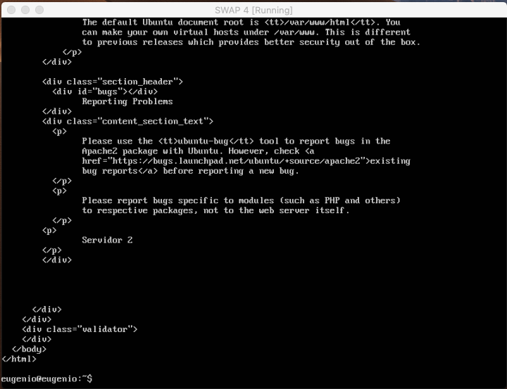
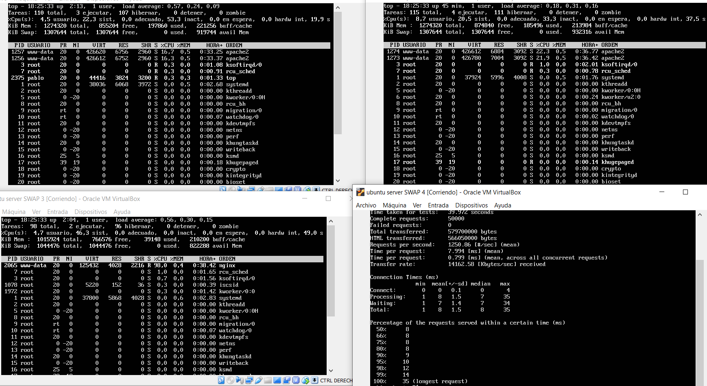
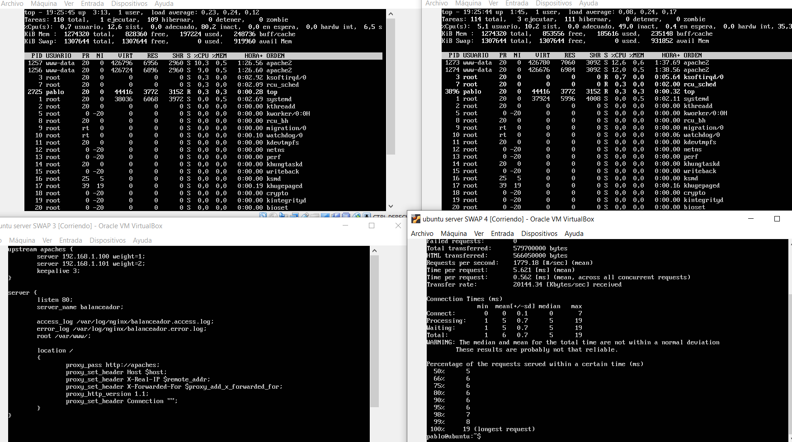
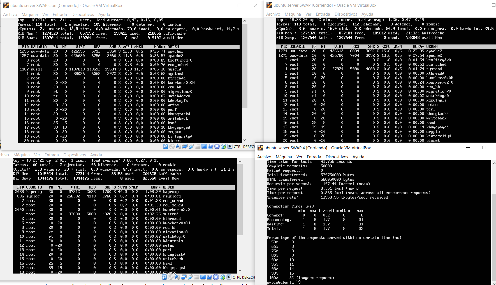

# Práctica 3
### Autores
Eugenio Alcántara García  
Pablo García Llorente

## Preparación de las herramientas

En esta práctica debemos crear una nueva máquina que funcionará como balanceador de carga, tomará las peticiones lanzadas desde una cuarta máquina y las distribuirá entre nuestras máquinas servidor que hemos creado a lo largo de las dos primeras prácticas. Con esto conseguiremos repartir el trabajo entre todas nuestras máquinas, el trabajo se puede distribuir de múltiples formas mediante diferentes algoritmos y diferentes balanceadores de carga, en esta práctica utilizaremos dos tipos NginX y HaProxy, para instalar NginX ejecutaremos las siguientes ordenes:

      $sudo apt-get update && sudo apt-get dist-upgrade && sudo apt-get autoremove
      $sudo apt-get install nginx
      $sudo systemctl start nginx

A continuación hemos hemos instalado HaProxy en la misma máquina utilizando el siguiente comando:
      
      $sudo apt-get install haproxy
      

## Cuestiones a resolver

### Hay que llevar a cabo las siguientes tareas:
1. #### Configurar una máquina e instalar el nginx como balanceador de carga
2. #### Configurar una máquina e instalar el haproxy como balanceador de carga
3. #### Someter a la granja web a una alta carga, generada con la herramienta Apache Benchmark, teniendo primero nginx y después haproxy.

### 1. Configurar una máquina e instalar el NginX como balanceador de carga
En esta práctica vamos a utilizar NginX con el objetivo de de redirigir el tráfico entre un grupo de servidores, pero para ello la configuración básica de NginX no nos sirve, para modificarla debemos acceder al fichero de configuración /etc/nginx/conf.d/default.conf y debemos modificarlo como vemos a continuación:

upstream apaches {

//dirección de nuestros servidores

      server 192.168.1.100;
      
      server 192.168.1.101;
      
}
server{

      listen 80;
      
      server_name balanceador;
      access_log /var/log/nginx/balanceador.access.log;
      error_log /var/log/nginx/balanceador.error.log;
      root /var/www/;
      location /
      {
            proxy_pass http://apaches;
            proxy_set_header Host $host;
            proxy_set_header X-Real-IP $remote_addr;
            proxy_set_header X-Forwarded-For $proxy_add_x_forwarded_for;
            proxy_http_version 1.1;
            proxy_set_header Connection "";
      }
}

Desde una cuarta máquina virtual hemos pedido al balanceador que nos muestre la página index.html. Puesto que nginx usa un algoritmo Round-Robin, este primero muestra el index.html del servidor 1. Si seguidamente se lo volvemos a pedir al balanceador, este mostrará el index.html del servidor 2. 

### 2. Configurar una máquina e instalar el haproxy como balanceador de carga

      
      
### 3. Someter a la granja web a una alta carga, generada con la herramienta Apache Benchmark, teniendo primero nginx y después haproxy.

Mediante la herramienta top (puesta en el servidor 1, servidor 2 y balanceador) podemos ver el benchmark lanzado a través de la cuarta máquina virtual. 

