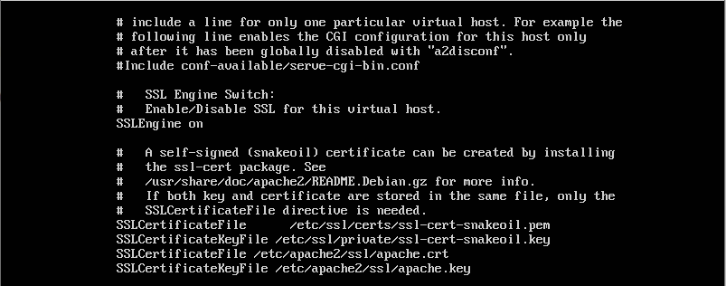
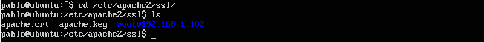

# Práctica 4
### Autores
Eugenio Alcántara García  
Pablo García Llorente

## Generar e instalar un certificado autofirmado
Lo primero que debemos hacer para generar un certificado SSL autofirmado en Ubuntu Server, es activando activando los SSL de Apache, generar los certificados y especifinado los ruta a los certificados en la confirguración. 

    $ a2enmod ssl
    $ service apache2 restart
    $ mkdir /etc/apache2/ssl
    $ openssl req -x509 -nodes -days 365 -newkey rsa:2048 -keyout /etc/apache2/ssl/apache.key -out /etc/apache2/ssl/apache.crt

Una vez hayamos introducido una serie de datos que nos pedirá al ejecutar esa última ordern, procederemos a editar el archivo de configuración del sitio default-ssl. 

    $ nano /etc/apache2/sites-available/default-ssl
    
Y le agregaremos dos nuevos cerficiados debajo de la línea donde pone SSLEngine on. 
    
    SSLCertificateFile /etc/apache2/ssl/apache.crt 
    SSLCertificateKeyFile /etc/apache2/ssl/apache.key
    
Depués de haber añadido esos dos certificados, el archivo default-ssl quedaría como en la imagen de a continucación. 

Una vez guardado el archivo (siendo super usaurio), activamos el sitio default-ssl y reiniciamos apache.
        
    $ 2ensite default-ssl
    $ service apache2 reload
    
Cuando tengamos reiniciado Apache, vamos a acceder al servidor web mediante el protocolo HTTPS. Por último, como petendemos que la granja nos permita usar el HTTPS, vamos a configurar el balanceador par que también acepte este trácfico. Para ello tendremos que copiar los archivos .crt y .key a todas las máquinas de la granja web.  

    $ sudo scp apache.crt eugenio@192.168.1.101:apache.crt 
    $ sudo scp apache.crt eugenio@192.168.1.101:apache.key
    
Esa dos líneas de comandos tendremos que lanzarlas para cada máquina virtual. En el caso del balanceador tendremos que instalar SSH previamente oara pocer ejecutar los comandos anteriores. Una vez hayamos ejecutado ambas órdenes, los moveremos al directorio /etc/apache2/ssl con el comando mov.

